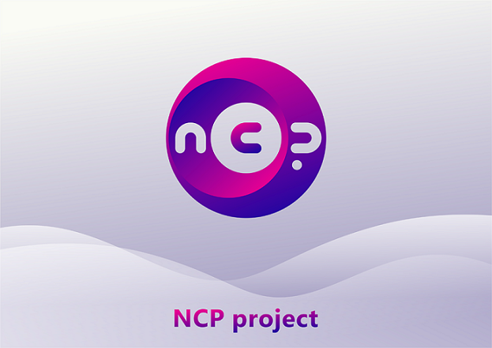

# Newton
[](https://travis-ci.com/ncpproject/Newton)

[Official Website](https://newtoncoin.site) , [Support](mailto:support@newtoncoin.site)  


Newton is an open-source wallet for Windows, macOS and Linux depends on [Wavesfx](https://github.com/wavesfx)
for [NCP Project Asset](http://dev.pywaves.org/assets/G1emXxRGHxDSe5sduNmqULJdKngRjk3C6d7nPw19fK86)

Releases can be found on the [release](https://github.com/ncpproject/Newton/releases) list.


# How to build Newton

## 1. Prerequisites

### Install Java Development Kit (JDK) 14

[OpenJDK](https://jdk.java.net/13/) and [AdoptOpenJDK](https://adoptopenjdk.net/archive.html) are excellent choices. 

## 2. Obtain Source Code

```
git clone github.com/ncpproject/Newton
cd Newton
```
## 3. Compilation and packaging
### Build binary package
```
./gradlew jpackageImage 
```  
### Build installer
**Note:** Wix, a third-party tool, is required to generate an installer for Windows.
```
./gradlew jpackage
```
